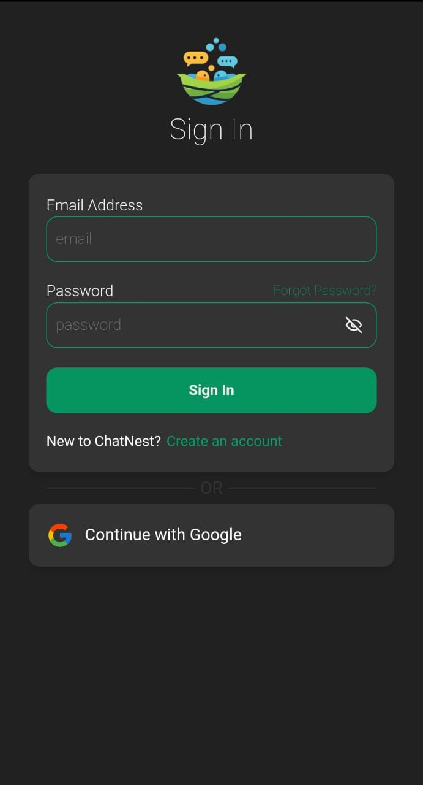
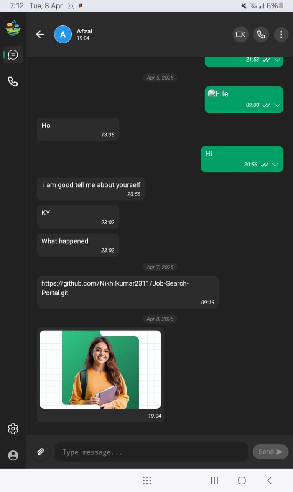
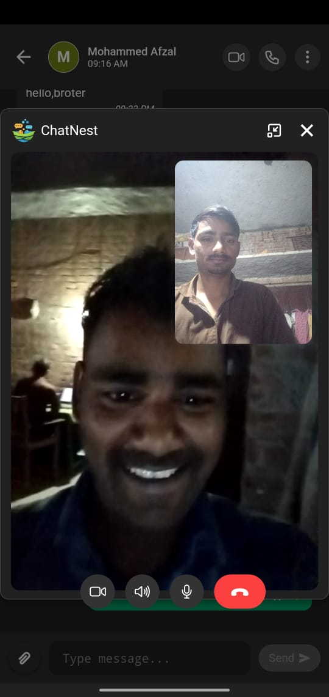
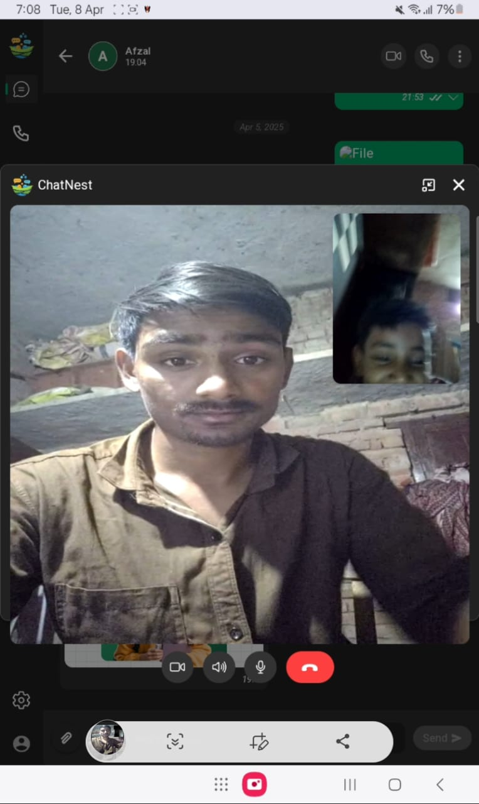

# ChatNest - Audio/Video Calling using MERN Stack

ChatNest is a real-time chat application built using the MERN stack (MongoDB, Express, React, Node.js) with additional support for audio and video calling. This app allows users to sign up and log in using their email addresses, instead of phone numbers, and engage in real-time messaging and calling.

## Features
- **Email-based Authentication:** Users can sign up or log in using their email and password.
- **Real-time Messaging:** Chat with friends and family in real-time with messages instantly delivered.
- **Audio and Video Calling:** Make audio and video calls to your contacts.
- **Profile Management:** Users can set up their profile with a custom display name and photo.
- **User Invitations:** Send invitation links to new users via email.
- **Responsive UI:** The app is mobile-friendly and adapts well to different screen sizes.

## Tech Stack
- **Frontend:** React.js
- **Backend:** Node.js with Express.js
- **Database:** MongoDB (using Mongoose for object data modeling)
- **Authentication:** JWT (JSON Web Tokens)
- **Realtime Communication:** Socket.io for real-time messaging and communication
- **Audio/Video Calling:** WebRTC (for peer-to-peer communication)

## Prerequisites
Before you begin, make sure you have the following installed:
- Node.js
- MongoDB (or use MongoDB Atlas for cloud database)

## Installation

### 1. Clone the repository

```bash
 git https://github.com/Afzal-Mia/Audio_Video_Calling_App.git
```

### 2. Install Backend Dependencies
 ```bash
 cd server
 npm start
```

### 3. Setup Environment Variables
Create a .env file in the backend folder and add the following variables:

 ```bash
 MONGO_URI=your_mongo_database_url
 GOOGLE_CLIENT_ID=your_google_client_id
 GOOGLE_CLIENT_SECRET=your_google_client_secret
 ```  
### 4. Run the Application

Now, you can run both the backend and frontend servers.

Run the backend (Node.js/Express):
       
```bash
cd server
npm start
```
Run the frontend (React.js)
  
```bash
npm start
```
The app should now be running on http://localhost:3000.

## Usage
1. **Sign Up / Login:** Use your email to create an account or log in.
2. **Start a Chat:** Click on any user from the contact list to start a conversation.
3. **Send a Message:** Type your message and hit send to deliver in real-time.
4. **Audio/Video Call:** Click on the audio/video call buttons to initiate a call.

## Screenshots
Here are some screenshots of the app:

* **Login Screen:**
    
* **Chat Screen:**
    
* **Video Calling Screen:**
    
    
    

